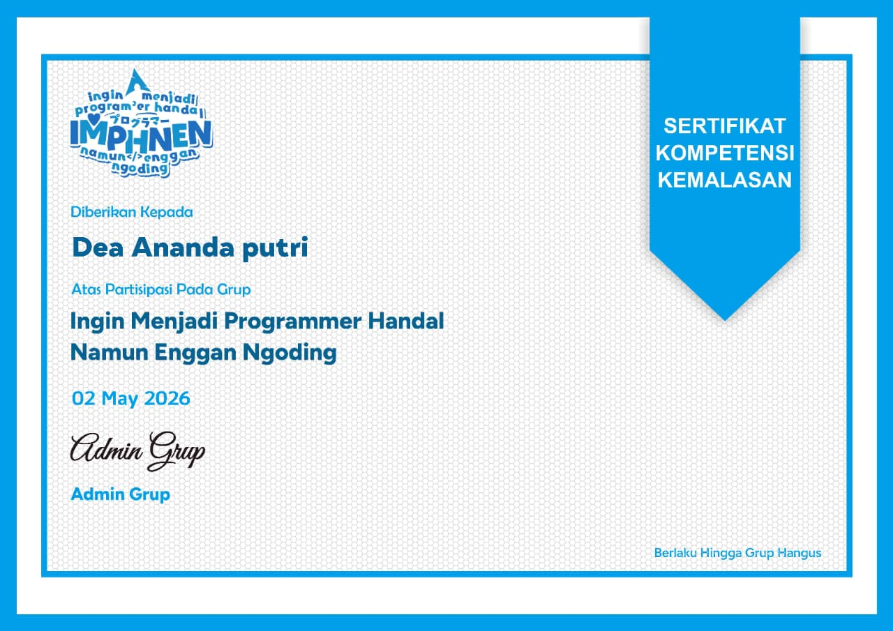

# Welcome to my GitHub Profile!

 

<table align="center" border="0" cellspacing="0" cellpadding="20">
  <tr>
    <td valign="center" width="350">
      <h3> About Me</h3>
      <pre>
School    : Vocational High School,
            Software Engineering
Learning  : Flutter & Node.js
Interest  : Web Design &
            Digital Drawing
      </pre>
    </td>
    <td align="center" valign="center" width="200">
      
    </td>
  </tr>
</table>

---

## 💻 Tech Stack

 

 

---

  
   

---

